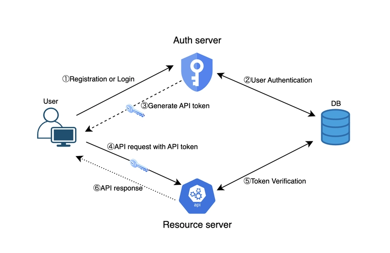
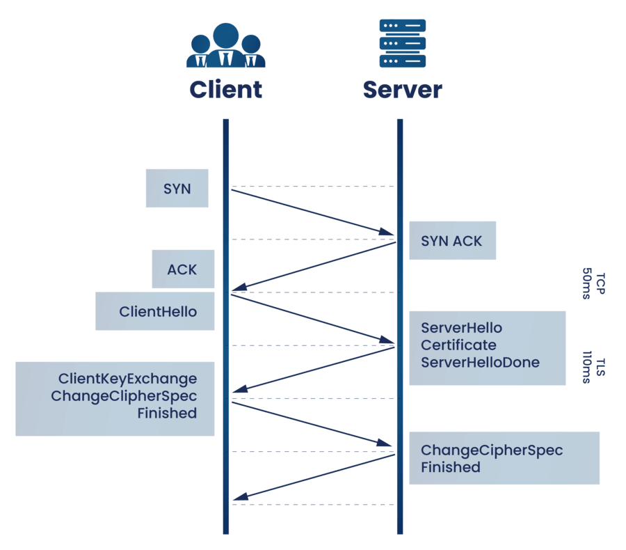

# Dokumentacja rozwiązań zabezpieczeń serwera
_Projekt systemu umożliwiającego kontrolowanie pieca_

_Przygotował: Mateusz Rosiński, 48491_
##  Elementy podlegajce zabezpieczeniu
1. API
2. Broker MQTT
3. Baza danych
## Opis zabezpieczeń
### 1. API
#### Sposób zabezpieczenia wszystkich endpointów

Zabezpieczenie za pomocą API Tokens nadawanych przy autentykacji.
Konieczne dodatkowo jest uzycie komunikacji HTTPS.

#### Technologie

- **Laravel Sanctum**: biblioteka wspiera API Tokens, jest
kompatybilna z technologią tworzenia API (Laravel).

### 2. Broker MQTT
#### Co trzeba zabezpieczyć?
- Zdefiniowanie ACL (kto czyta tematy/kto publikuje do tematów).
- Publikujący łączy się poprzez TLS.

- Jedyne otwarte porty to jeden dla ruchu zewnętrznego i jeden dla lokalnego.
- Wyłączenie możliwości anaonimowych połączeń.
- Określenie konkretnie użytkownikow.
#### Technologie
Wszystkie opisane metody zabezpieczenia jest w stanie zrealizować Mosquitto czyli oprogramowanie brokera.

### 3. Baza danych
Jest rozważana jako element systemu.

(proponowane rozwiązanie PostgreSQL + TimescaleDB)

Decyzja o jej włączeniu a tym samym zakresie zabezpieczeń nie została jeszcze podjęta.
